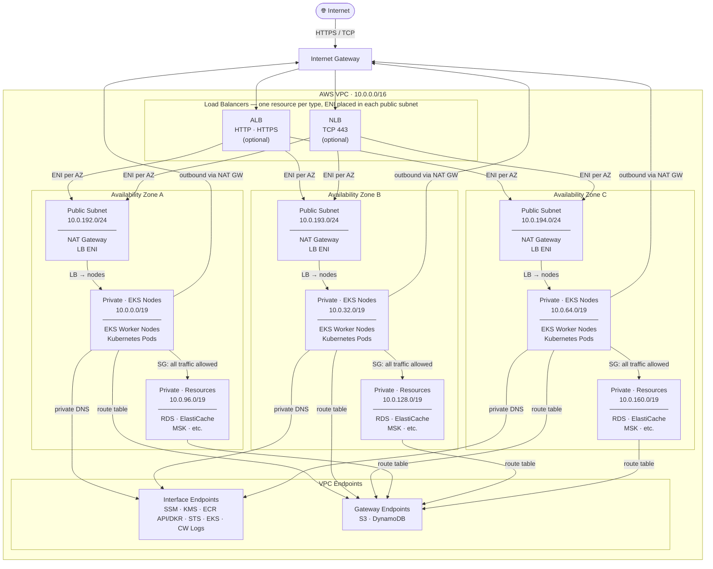

# urukube-terraform-module-networking

A comprehensive Terraform module for setting up AWS networking infrastructure required for EKS clusters. This module provides a one-stop solution for VPC, subnets, NAT gateways, security groups, VPC endpoints, and optional Network/Application Load Balancer configuration.

## Features

- 🌐 **Complete VPC Setup** - VPC with configurable CIDR blocks and DNS settings
- 🏢 **Multi-AZ Architecture** - High availability across multiple availability zones
- 🔒 **Private & Public Subnets** - Auto-calculated subnet CIDRs with proper EKS tagging
- 🚀 **NAT Gateway** - HA or single NAT gateway options for cost optimization
- 🔐 **Security Groups** - Pre-configured for EKS nodes, control plane, and VPC endpoints
- 🔌 **VPC Endpoints** - Interface and gateway endpoints for AWS services (SSM, KMS, ECR, S3, etc.)
- ⚖️ **Network Load Balancer** - Optional NLB for external access
- ⚖️ **Application Load Balancer** - Optional ALB with HTTP/HTTPS support
- 🕸️ **Service Mesh Ready** - Optional Istio security group configuration
- 📊 **VPC Flow Logs** - Optional CloudWatch logging for network traffic analysis
- 🏷️ **EKS Auto-Discovery** - Proper subnet tagging for automatic EKS integration

## Architecture

### Network Layout

The VPC is divided into **three subnet tiers**, each replicated across up to 3 Availability Zones for high availability. The tiers are purpose-built — each one has a distinct routing policy and security group to enforce the principle of least privilege.



---

### Communication Flows

| # | Flow | Mechanism | Notes |
|---|---|---|---|
| **1** | **EKS Nodes → Internet** (outbound) | NAT Gateway in public subnet | Required to pull images from public registries or call external APIs |
| **2** | **EKS Nodes → Resource Tier** | VPC local route + Security Group | `aws_resources` SG allows all inbound from `eks_nodes` SG. No NAT needed — same VPC |
| **3** | **EKS Nodes → AWS Services** | VPC Interface Endpoints (private DNS) | SSM, KMS, ECR, STS, EC2, etc. Traffic never leaves AWS network |
| | **EKS Nodes → S3 / DynamoDB** | VPC Gateway Endpoints | Routes injected into EKS node and resource tier route tables |
| | **Internet → Load Balancer** | Internet Gateway → ALB / NLB in public subnet | External traffic enters only through LBs |
| | **Load Balancer → EKS Nodes** | LB target group → EKS node SG (port 443 / NodePort) | EKS nodes SG allows HTTPS from anywhere when NLB is enabled |
| | **EKS Control Plane ↔ Nodes** | Security Group rules (bidirectional) | HTTPS (443) both directions; kubelet (1025–65535) control plane → nodes |
| | **Resource Tier → Internet** | **Not routed** | Resource subnets are `intra` (no NAT GW route). Managed services (RDS, ElastiCache) do not need outbound internet |

---

### Subnet CIDR Auto-Calculation

With the default VPC CIDR `10.0.0.0/16` and 3 AZs:

| Tier | AZ-A | AZ-B | AZ-C | Size | Route |
|---|---|---|---|---|---|
| **EKS Nodes** (private) | `10.0.0.0/19` | `10.0.32.0/19` | `10.0.64.0/19` | 8,192 IPs | → NAT GW |
| **Resources** (private) | `10.0.96.0/19` | `10.0.128.0/19` | `10.0.160.0/19` | 8,192 IPs | VPC local only |
| **Public** | `10.0.192.0/24` | `10.0.193.0/24` | `10.0.194.0/24` | 256 IPs | → IGW |

The EKS node tier is sized `/19` (8,192 IPs) to accommodate large pod densities. The public tier is `/24` (256 IPs) since it hosts only NAT Gateways and load balancers.

## Inputs

| Name                           | Description                           | Type           | Default         | Required |
| :----------------------------- | :------------------------------------ | :------------- | :-------------- | :------- |
| `bu_id`                        | Business Unit                         | `string`       | `null`          | **yes**  |
| `app_id`                       | Application Unit                      | `string`       | `null`          | **yes**  |
| `env`                          | Environment name (dev, staging, prod) | `string`       | n/a             | **yes**  |
| `vpc_cidr`                     | CIDR block for VPC                    | `string`       | `"10.0.0.0/16"` | no       |
| `azs`                          | Availability zones                    | `list(string)` | `[]`            | no       |
| `private_subnets`              | Private subnet CIDRs                  | `list(string)` | `[]`            | no       |
| `public_subnets`               | Public subnet CIDRs                   | `list(string)` | `[]`            | no       |
| `enable_nat_gateway`           | Enable NAT Gateway                    | `bool`         | `true`          | no       |
| `single_nat_gateway`           | Use single NAT Gateway                | `bool`         | `false`         | no       |
| `enable_dns_hostnames`         | Enable DNS hostnames                  | `bool`         | `true`          | no       |
| `enable_dns_support`           | Enable DNS support                    | `bool`         | `true`          | no       |
| `enable_vpn_gateway`           | Enable VPN Gateway                    | `bool`         | `false`         | no       |
| `enable_flow_logs`             | Enable VPC Flow Logs                  | `bool`         | `false`         | no       |
| `flow_logs_retention_days`     | Flow logs retention days              | `number`       | `7`             | no       |
| `enable_vpc_endpoints`         | Enable VPC endpoints                  | `bool`         | `true`          | no       |
| `vpc_endpoints`                | VPC endpoints map                     | `map(bool)`    | `{...}`         | no       |
| `enable_network_load_balancer` | Enable NLB                            | `bool`         | `false`         | no       |
| `nlb_subnet_ids`               | NLB subnet IDs                        | `list(string)` | `[]`            | no       |
| `nlb_deletion_protection`      | NLB deletion protection               | `bool`         | `true`          | no       |
| `nlb_access_logs_bucket_name`  | NLB logs bucket                       | `string`       | `null`          | no       |
| `nlb_access_logs_prefix`       | NLB logs prefix                       | `string`       | `null`          | no       |
| `enable_alb`                   | Enable ALB                            | `bool`         | `false`         | no       |
| `alb_subnet_ids`               | ALB subnet IDs                        | `list(string)` | `[]`            | no       |
| `alb_deletion_protection`      | ALB deletion protection               | `bool`         | `true`          | no       |
| `alb_access_logs_bucket_name`  | ALB logs bucket                       | `string`       | `null`          | no       |
| `alb_access_logs_prefix`       | ALB logs prefix                       | `string`       | `null`          | no       |
| `alb_http_enabled`             | Enable ALB HTTP                       | `bool`         | `true`          | no       |
| `alb_https_enabled`            | Enable ALB HTTPS                      | `bool`         | `true`          | no       |
| `alb_certificate_arn`          | ALB Certificate ARN                   | `string`       | `null`          | no       |
| `alb_ingress_cidr_blocks`      | ALB Ingress CIDRs                     | `list(string)` | `["0.0.0.0/0"]` | no       |
| `enable_istio_support`         | Enable Istio support                  | `bool`         | `false`         | no       |
| `tags`                         | Additional tags                       | `map(string)`  | `{}`            | no       |

## Outputs

| Name                                 | Description                              |
| :----------------------------------- | :--------------------------------------- |
| `vpc_id`                             | VPC ID                                   |
| `vpc_cidr`                           | VPC CIDR block                           |
| `vpc_arn`                            | ARN of the VPC                           |
| `vpc_tags`                           | Tags applied to the VPC                  |
| `private_subnet_ids`                 | List of private subnet IDs               |
| `public_subnet_ids`                  | List of public subnet IDs                |
| `all_subnet_ids`                     | Combined list of all subnet IDs          |
| `private_subnet_cidrs`               | List of private subnet CIDR blocks       |
| `public_subnet_cidrs`                | List of public subnet CIDR blocks        |
| `nat_gateway_ids`                    | NAT Gateway IDs                          |
| `nat_gateway_public_ips`             | Elastic IPs of NAT Gateways              |
| `azs`                                | Availability zones used                  |
| `node_security_group_id`             | Security group ID for EKS nodes          |
| `control_plane_security_group_id`    | Security group ID for EKS control plane  |
| `vpc_endpoint_security_group_id`     | Security group ID for VPC endpoints      |
| `istio_security_group_id`            | Security group ID for Istio service mesh |
| `vpc_default_security_group_id`      | Default VPC security group ID            |
| `vpc_endpoints`                      | Map of VPC endpoint IDs                  |
| `vpc_endpoint_interface_dns_entries` | DNS entries for interface VPC endpoints  |
| `nlb_arn`                            | Network Load Balancer ARN                |
| `nlb_dns_name`                       | Network Load Balancer DNS name           |
| `nlb_zone_id`                        | Network Load Balancer hosted zone ID     |
| `nlb_target_group_arn`               | NLB target group ARN                     |
| `alb_arn`                            | Application Load Balancer ARN            |
| `alb_dns_name`                       | Application Load Balancer DNS name       |
| `alb_zone_id`                        | Application Load Balancer hosted zone ID |
| `alb_security_group_id`              | Security group ID for ALB                |

## Usage

### Comprehensive Example with All Parameters

```hcl
module "networking" {
  source = "github.com/orbitcluster/oc-terraform-module-networking"

  # ===================================
  # Required Parameters
  # ===================================

  # Business Unit ID
  bu_id = "marketing"

  # Application ID
  app_id = "ecommerce"

  # Environment: dev, staging, or prod
  env = "prod"

  # ===================================
  # VPC Configuration (Optional)
  # ===================================

  # VPC CIDR block (default: "10.0.0.0/16")
  vpc_cidr = "10.0.0.0/16"

  # Availability zones (default: auto-detect 2-3 AZs in region)
  azs = ["us-east-1a", "us-east-1b", "us-east-1c"]

  # EKS node subnet CIDRs (default: auto-calculated from vpc_cidr)
  # These subnets host EKS worker nodes and pods — one per AZ
  eks_node_subnets = ["10.0.0.0/19", "10.0.32.0/19", "10.0.64.0/19"]

  # Resource subnet CIDRs (default: auto-calculated from vpc_cidr)
  # These subnets host RDS, ElastiCache, MSK, etc. — VPC-local only, no NAT
  resource_subnets = ["10.0.96.0/19", "10.0.128.0/19", "10.0.160.0/19"]

  # Public subnet CIDRs (default: auto-calculated from vpc_cidr)
  # These subnets host NAT gateways and load balancers — one per AZ
  public_subnets = ["10.0.192.0/24", "10.0.193.0/24", "10.0.194.0/24"]

  # Enable DNS hostnames in VPC (default: true)
  enable_dns_hostnames = true

  # Enable DNS support in VPC (default: true)
  enable_dns_support = true

  # Enable VPN Gateway (default: false)
  enable_vpn_gateway = false

  # ===================================
  # NAT Gateway Configuration (Optional)
  # ===================================

  # Enable NAT Gateway for private subnet internet access (default: true)
  enable_nat_gateway = true

  # Use single NAT Gateway instead of one per AZ (default: false)
  # Set to true for cost savings in dev/test (~$32/mo vs ~$96/mo for 3 AZs)
  # Set to false for production HA
  single_nat_gateway = false

  # ===================================
  # VPC Endpoints Configuration (Optional)
  # ===================================

  # Enable VPC endpoints for AWS services (default: true)
  # Reduces NAT Gateway costs and improves security
  enable_vpc_endpoints = true

  # Individual VPC endpoint controls
  vpc_endpoints = {
    ssm         = true  # Systems Manager
    ssmmessages = true  # SSM Session Manager
    ec2messages = true  # SSM agent communication
    kms         = true  # Key Management Service
    ecr_api     = true  # ECR API (for pulling container images)
    ecr_dkr     = true  # ECR Docker registry
    ec2         = true  # EC2 API
    sts         = true  # Security Token Service
    logs        = true  # CloudWatch Logs
    s3          = true  # S3 Gateway endpoint
    dynamodb    = false # DynamoDB Gateway endpoint
  }

  # ===================================
  # Network Load Balancer (Optional)
  # ===================================

  # Create Network Load Balancer in public subnets (default: false)
  enable_network_load_balancer = true

  # Subnet IDs for NLB (default: uses public_subnets)
  # nlb_subnet_ids = ["subnet-xxx", "subnet-yyy"]

  # Enable deletion protection for NLB (default: true)
  nlb_deletion_protection = true

  # ===================================
  # Application Load Balancer (Optional)
  # ===================================

  # Create Application Load Balancer (default: false)
  enable_alb = true

  # Enable HTTP Listener (default: true)
  alb_http_enabled = true

  # Enable HTTPS Listener (default: true)
  alb_https_enabled = true

  # ACM Certificate ARN for HTTPS listener
  alb_certificate_arn = "arn:aws:acm:us-east-1:123456789012:certificate/..."

  # ===================================
  # Service Mesh Support (Optional)
  # ===================================

  # Configure security groups for Istio service mesh (default: false)
  # Adds ingress rules for Istio ports (15010-15012, 8080, 8443)
  enable_istio_support = true

  # ===================================
  # VPC Flow Logs (Optional)
  # ===================================

  # Enable VPC Flow Logs to CloudWatch (default: false)
  enable_flow_logs = true

  # CloudWatch log retention in days (default: 7)
  # Valid values: 1, 3, 5, 7, 14, 30, 60, 90, 120, 150, 180, 365, 400, 545, 731, etc.
  flow_logs_retention_days = 30
}
```

## Security Best Practices

1. **Use VPC Endpoints** - Reduce exposure to internet and lower NAT costs
2. **Enable Flow Logs** - Monitor network traffic for security analysis
3. **Private Subnets** - Run EKS nodes in private subnets only
4. **Security Groups** - Use provided security groups instead of wide-open rules
5. **Multi-AZ** - Deploy across multiple AZs for high availability

## License

This module is part of OrbitCluster and follows the project's licensing terms.

<!-- BEGIN_TF_DOCS -->
## Requirements

| Name | Version |
|------|---------|
| <a name="requirement_terraform"></a> [terraform](#requirement\_terraform) | >= 1.5.0 |
| <a name="requirement_aws"></a> [aws](#requirement\_aws) | >= 6.15.0, <= 6.31.0 |

## Providers

| Name | Version |
|------|---------|
| <a name="provider_aws"></a> [aws](#provider\_aws) | >= 6.15.0, <= 6.31.0 |

## Modules

| Name | Source | Version |
|------|--------|---------|
| <a name="module_vpc"></a> [vpc](#module\_vpc) | terraform-aws-modules/vpc/aws | ~> 5.5.0 |

## Resources

| Name | Type |
|------|------|
| [aws_lb.application](https://registry.terraform.io/providers/hashicorp/aws/latest/docs/resources/lb) | resource |
| [aws_lb.network](https://registry.terraform.io/providers/hashicorp/aws/latest/docs/resources/lb) | resource |
| [aws_lb_listener.application_http](https://registry.terraform.io/providers/hashicorp/aws/latest/docs/resources/lb_listener) | resource |
| [aws_lb_listener.application_https](https://registry.terraform.io/providers/hashicorp/aws/latest/docs/resources/lb_listener) | resource |
| [aws_lb_listener.network](https://registry.terraform.io/providers/hashicorp/aws/latest/docs/resources/lb_listener) | resource |
| [aws_lb_target_group.application](https://registry.terraform.io/providers/hashicorp/aws/latest/docs/resources/lb_target_group) | resource |
| [aws_lb_target_group.network](https://registry.terraform.io/providers/hashicorp/aws/latest/docs/resources/lb_target_group) | resource |
| [aws_security_group.alb](https://registry.terraform.io/providers/hashicorp/aws/latest/docs/resources/security_group) | resource |
| [aws_security_group.aws_resources](https://registry.terraform.io/providers/hashicorp/aws/latest/docs/resources/security_group) | resource |
| [aws_security_group.eks_control_plane](https://registry.terraform.io/providers/hashicorp/aws/latest/docs/resources/security_group) | resource |
| [aws_security_group.eks_nodes](https://registry.terraform.io/providers/hashicorp/aws/latest/docs/resources/security_group) | resource |
| [aws_security_group.istio](https://registry.terraform.io/providers/hashicorp/aws/latest/docs/resources/security_group) | resource |
| [aws_security_group.vpc_endpoints](https://registry.terraform.io/providers/hashicorp/aws/latest/docs/resources/security_group) | resource |
| [aws_vpc_endpoint.gateway](https://registry.terraform.io/providers/hashicorp/aws/latest/docs/resources/vpc_endpoint) | resource |
| [aws_vpc_endpoint.interface](https://registry.terraform.io/providers/hashicorp/aws/latest/docs/resources/vpc_endpoint) | resource |
| [aws_vpc_security_group_egress_rule.alb_egress](https://registry.terraform.io/providers/hashicorp/aws/latest/docs/resources/vpc_security_group_egress_rule) | resource |
| [aws_vpc_security_group_egress_rule.control_plane_to_nodes_https](https://registry.terraform.io/providers/hashicorp/aws/latest/docs/resources/vpc_security_group_egress_rule) | resource |
| [aws_vpc_security_group_egress_rule.control_plane_to_nodes_kubelet](https://registry.terraform.io/providers/hashicorp/aws/latest/docs/resources/vpc_security_group_egress_rule) | resource |
| [aws_vpc_security_group_egress_rule.eks_nodes_egress](https://registry.terraform.io/providers/hashicorp/aws/latest/docs/resources/vpc_security_group_egress_rule) | resource |
| [aws_vpc_security_group_egress_rule.istio_egress](https://registry.terraform.io/providers/hashicorp/aws/latest/docs/resources/vpc_security_group_egress_rule) | resource |
| [aws_vpc_security_group_egress_rule.resources_egress](https://registry.terraform.io/providers/hashicorp/aws/latest/docs/resources/vpc_security_group_egress_rule) | resource |
| [aws_vpc_security_group_egress_rule.vpc_endpoints_egress](https://registry.terraform.io/providers/hashicorp/aws/latest/docs/resources/vpc_security_group_egress_rule) | resource |
| [aws_vpc_security_group_ingress_rule.alb_http](https://registry.terraform.io/providers/hashicorp/aws/latest/docs/resources/vpc_security_group_ingress_rule) | resource |
| [aws_vpc_security_group_ingress_rule.alb_https](https://registry.terraform.io/providers/hashicorp/aws/latest/docs/resources/vpc_security_group_ingress_rule) | resource |
| [aws_vpc_security_group_ingress_rule.control_plane_from_nodes](https://registry.terraform.io/providers/hashicorp/aws/latest/docs/resources/vpc_security_group_ingress_rule) | resource |
| [aws_vpc_security_group_ingress_rule.eks_nodes_nlb_ingress](https://registry.terraform.io/providers/hashicorp/aws/latest/docs/resources/vpc_security_group_ingress_rule) | resource |
| [aws_vpc_security_group_ingress_rule.eks_nodes_vpc_ingress](https://registry.terraform.io/providers/hashicorp/aws/latest/docs/resources/vpc_security_group_ingress_rule) | resource |
| [aws_vpc_security_group_ingress_rule.istio_https](https://registry.terraform.io/providers/hashicorp/aws/latest/docs/resources/vpc_security_group_ingress_rule) | resource |
| [aws_vpc_security_group_ingress_rule.istio_ingress](https://registry.terraform.io/providers/hashicorp/aws/latest/docs/resources/vpc_security_group_ingress_rule) | resource |
| [aws_vpc_security_group_ingress_rule.istio_pilot](https://registry.terraform.io/providers/hashicorp/aws/latest/docs/resources/vpc_security_group_ingress_rule) | resource |
| [aws_vpc_security_group_ingress_rule.resources_from_eks_nodes](https://registry.terraform.io/providers/hashicorp/aws/latest/docs/resources/vpc_security_group_ingress_rule) | resource |
| [aws_vpc_security_group_ingress_rule.vpc_endpoints_https](https://registry.terraform.io/providers/hashicorp/aws/latest/docs/resources/vpc_security_group_ingress_rule) | resource |
| [aws_availability_zones.available](https://registry.terraform.io/providers/hashicorp/aws/latest/docs/data-sources/availability_zones) | data source |
| [aws_caller_identity.current](https://registry.terraform.io/providers/hashicorp/aws/latest/docs/data-sources/caller_identity) | data source |
| [aws_region.current](https://registry.terraform.io/providers/hashicorp/aws/latest/docs/data-sources/region) | data source |

## Inputs

| Name | Description | Type | Default | Required |
|------|-------------|------|---------|:--------:|
| <a name="input_alb_access_logs_bucket_name"></a> [alb\_access\_logs\_bucket\_name](#input\_alb\_access\_logs\_bucket\_name) | S3 bucket name for ALB access logs. If null, logging is disabled | `string` | `null` | no |
| <a name="input_alb_access_logs_prefix"></a> [alb\_access\_logs\_prefix](#input\_alb\_access\_logs\_prefix) | S3 prefix for ALB access logs | `string` | `null` | no |
| <a name="input_alb_certificate_arn"></a> [alb\_certificate\_arn](#input\_alb\_certificate\_arn) | ARN of ACM certificate for HTTPS listener | `string` | `null` | no |
| <a name="input_alb_deletion_protection"></a> [alb\_deletion\_protection](#input\_alb\_deletion\_protection) | Enable deletion protection for ALB | `bool` | `true` | no |
| <a name="input_alb_http_enabled"></a> [alb\_http\_enabled](#input\_alb\_http\_enabled) | Enable HTTP listener for ALB | `bool` | `true` | no |
| <a name="input_alb_https_enabled"></a> [alb\_https\_enabled](#input\_alb\_https\_enabled) | Enable HTTPS listener for ALB | `bool` | `true` | no |
| <a name="input_alb_ingress_cidr_blocks"></a> [alb\_ingress\_cidr\_blocks](#input\_alb\_ingress\_cidr\_blocks) | List of CIDR blocks to allow ingress to ALB (HTTP/HTTPS) | `list(string)` | <pre>[<br/>  "0.0.0.0/0"<br/>]</pre> | no |
| <a name="input_alb_subnet_ids"></a> [alb\_subnet\_ids](#input\_alb\_subnet\_ids) | Subnet IDs for ALB. If not specified, uses public subnets | `list(string)` | `[]` | no |
| <a name="input_app_id"></a> [app\_id](#input\_app\_id) | application Unit | `string` | `null` | no |
| <a name="input_azs"></a> [azs](#input\_azs) | List of availability zones. If not provided, will auto-detect 2-3 AZs in the region | `list(string)` | `[]` | no |
| <a name="input_bu_id"></a> [bu\_id](#input\_bu\_id) | Business Unit | `string` | `null` | no |
| <a name="input_eks_node_subnets"></a> [eks\_node\_subnets](#input\_eks\_node\_subnets) | CIDR blocks for EKS node subnets (private, has NAT GW route). If not provided, auto-calculates from VPC CIDR | `list(string)` | `[]` | no |
| <a name="input_enable_alb"></a> [enable\_alb](#input\_enable\_alb) | Create Application Load Balancer | `bool` | `false` | no |
| <a name="input_enable_dns_hostnames"></a> [enable\_dns\_hostnames](#input\_enable\_dns\_hostnames) | Enable DNS hostnames in VPC | `bool` | `true` | no |
| <a name="input_enable_dns_support"></a> [enable\_dns\_support](#input\_enable\_dns\_support) | Enable DNS support in VPC | `bool` | `true` | no |
| <a name="input_enable_flow_logs"></a> [enable\_flow\_logs](#input\_enable\_flow\_logs) | Enable VPC Flow Logs to CloudWatch | `bool` | `false` | no |
| <a name="input_enable_istio_support"></a> [enable\_istio\_support](#input\_enable\_istio\_support) | Configure security groups for Istio service mesh | `bool` | `false` | no |
| <a name="input_enable_nat_gateway"></a> [enable\_nat\_gateway](#input\_enable\_nat\_gateway) | Enable NAT Gateway for private subnets | `bool` | `true` | no |
| <a name="input_enable_network_load_balancer"></a> [enable\_network\_load\_balancer](#input\_enable\_network\_load\_balancer) | Create Network Load Balancer in public subnets | `bool` | `false` | no |
| <a name="input_enable_vpc_endpoints"></a> [enable\_vpc\_endpoints](#input\_enable\_vpc\_endpoints) | Enable VPC endpoints for AWS services | `bool` | `true` | no |
| <a name="input_enable_vpn_gateway"></a> [enable\_vpn\_gateway](#input\_enable\_vpn\_gateway) | Enable VPN Gateway | `bool` | `false` | no |
| <a name="input_env"></a> [env](#input\_env) | Environment name (dev, staging, prod) | `string` | n/a | yes |
| <a name="input_flow_logs_retention_days"></a> [flow\_logs\_retention\_days](#input\_flow\_logs\_retention\_days) | CloudWatch log retention for flow logs in days | `number` | `7` | no |
| <a name="input_friendly_name"></a> [friendly\_name](#input\_friendly\_name) | Friendly name prefix for resources (e.g., 'allhub', 'devspoke'). Used in resource naming and EKS cluster identification. | `string` | n/a | yes |
| <a name="input_nlb_access_logs_bucket_name"></a> [nlb\_access\_logs\_bucket\_name](#input\_nlb\_access\_logs\_bucket\_name) | S3 bucket name for NLB access logs. If null, logging is disabled | `string` | `null` | no |
| <a name="input_nlb_access_logs_prefix"></a> [nlb\_access\_logs\_prefix](#input\_nlb\_access\_logs\_prefix) | S3 prefix for NLB access logs | `string` | `null` | no |
| <a name="input_nlb_deletion_protection"></a> [nlb\_deletion\_protection](#input\_nlb\_deletion\_protection) | Enable deletion protection for Network Load Balancer | `bool` | `true` | no |
| <a name="input_nlb_subnet_ids"></a> [nlb\_subnet\_ids](#input\_nlb\_subnet\_ids) | Subnet IDs for NLB. If not specified, uses public subnets | `list(string)` | `[]` | no |
| <a name="input_public_subnets"></a> [public\_subnets](#input\_public\_subnets) | CIDR blocks for public subnets (for load balancers). If not provided, auto-calculates from VPC CIDR | `list(string)` | `[]` | no |
| <a name="input_resource_subnets"></a> [resource\_subnets](#input\_resource\_subnets) | CIDR blocks for AWS resource subnets (private, no NAT GW route). Hosts RDS, ElastiCache, and other managed services accessible by EKS nodes | `list(string)` | `[]` | no |
| <a name="input_single_nat_gateway"></a> [single\_nat\_gateway](#input\_single\_nat\_gateway) | Use single NAT Gateway to reduce costs (not recommended for production) | `bool` | `false` | no |
| <a name="input_tags"></a> [tags](#input\_tags) | Additional tags for all resources | `map(string)` | `{}` | no |
| <a name="input_vpc_cidr"></a> [vpc\_cidr](#input\_vpc\_cidr) | CIDR block for VPC | `string` | `"10.0.0.0/16"` | no |
| <a name="input_vpc_endpoints"></a> [vpc\_endpoints](#input\_vpc\_endpoints) | Map of VPC endpoints to create. Valid keys: ssm, ssmmessages, ec2messages, kms, ecr\_api, ecr\_dkr, ec2, sts, logs, s3, dynamodb | `map(bool)` | <pre>{<br/>  "dynamodb": false,<br/>  "ec2": true,<br/>  "ec2messages": true,<br/>  "ecr_api": true,<br/>  "ecr_dkr": true,<br/>  "kms": true,<br/>  "logs": true,<br/>  "s3": true,<br/>  "ssm": true,<br/>  "ssmmessages": true,<br/>  "sts": true<br/>}</pre> | no |

## Outputs

| Name | Description |
|------|-------------|
| <a name="output_alb_arn"></a> [alb\_arn](#output\_alb\_arn) | Application Load Balancer ARN (if created) |
| <a name="output_alb_dns_name"></a> [alb\_dns\_name](#output\_alb\_dns\_name) | Application Load Balancer DNS name (if created) |
| <a name="output_alb_security_group_id"></a> [alb\_security\_group\_id](#output\_alb\_security\_group\_id) | Security group ID for ALB (if created) |
| <a name="output_alb_zone_id"></a> [alb\_zone\_id](#output\_alb\_zone\_id) | Application Load Balancer hosted zone ID (if created) |
| <a name="output_all_subnet_ids"></a> [all\_subnet\_ids](#output\_all\_subnet\_ids) | Combined list of all subnet IDs across all tiers |
| <a name="output_aws_resources_security_group_id"></a> [aws\_resources\_security\_group\_id](#output\_aws\_resources\_security\_group\_id) | Security group ID for AWS managed resources (RDS, ElastiCache, etc.) — allows inbound from EKS nodes |
| <a name="output_azs"></a> [azs](#output\_azs) | Availability zones used |
| <a name="output_control_plane_security_group_id"></a> [control\_plane\_security\_group\_id](#output\_control\_plane\_security\_group\_id) | Security group ID for EKS control plane |
| <a name="output_eks_node_route_table_ids"></a> [eks\_node\_route\_table\_ids](#output\_eks\_node\_route\_table\_ids) | Route table IDs for EKS node subnets (has NAT GW route) |
| <a name="output_eks_node_subnet_cidrs"></a> [eks\_node\_subnet\_cidrs](#output\_eks\_node\_subnet\_cidrs) | CIDR blocks for EKS node subnets |
| <a name="output_eks_node_subnet_ids"></a> [eks\_node\_subnet\_ids](#output\_eks\_node\_subnet\_ids) | Subnet IDs for EKS node placement (private, has NAT GW route) |
| <a name="output_igw_id"></a> [igw\_id](#output\_igw\_id) | Internet Gateway ID |
| <a name="output_istio_security_group_id"></a> [istio\_security\_group\_id](#output\_istio\_security\_group\_id) | Security group ID for Istio service mesh |
| <a name="output_nat_gateway_ids"></a> [nat\_gateway\_ids](#output\_nat\_gateway\_ids) | NAT Gateway IDs |
| <a name="output_nat_gateway_public_ips"></a> [nat\_gateway\_public\_ips](#output\_nat\_gateway\_public\_ips) | Elastic IPs of NAT Gateways |
| <a name="output_nlb_arn"></a> [nlb\_arn](#output\_nlb\_arn) | Network Load Balancer ARN (if created) |
| <a name="output_nlb_dns_name"></a> [nlb\_dns\_name](#output\_nlb\_dns\_name) | Network Load Balancer DNS name (if created) |
| <a name="output_nlb_target_group_arn"></a> [nlb\_target\_group\_arn](#output\_nlb\_target\_group\_arn) | NLB target group ARN (if created) |
| <a name="output_nlb_zone_id"></a> [nlb\_zone\_id](#output\_nlb\_zone\_id) | Network Load Balancer hosted zone ID (if created) |
| <a name="output_node_security_group_id"></a> [node\_security\_group\_id](#output\_node\_security\_group\_id) | Security group ID for EKS nodes |
| <a name="output_public_route_table_ids"></a> [public\_route\_table\_ids](#output\_public\_route\_table\_ids) | Public route table IDs |
| <a name="output_public_subnet_cidrs"></a> [public\_subnet\_cidrs](#output\_public\_subnet\_cidrs) | CIDR blocks for public subnets |
| <a name="output_public_subnet_ids"></a> [public\_subnet\_ids](#output\_public\_subnet\_ids) | Subnet IDs for load balancers (public) |
| <a name="output_resource_route_table_ids"></a> [resource\_route\_table\_ids](#output\_resource\_route\_table\_ids) | Route table IDs for AWS resource subnets (VPC-local only) |
| <a name="output_resource_subnet_cidrs"></a> [resource\_subnet\_cidrs](#output\_resource\_subnet\_cidrs) | CIDR blocks for AWS resource subnets |
| <a name="output_resource_subnet_ids"></a> [resource\_subnet\_ids](#output\_resource\_subnet\_ids) | Subnet IDs for AWS managed resources — RDS, ElastiCache, etc. (private, VPC-local only) |
| <a name="output_vpc_arn"></a> [vpc\_arn](#output\_vpc\_arn) | ARN of the VPC |
| <a name="output_vpc_cidr"></a> [vpc\_cidr](#output\_vpc\_cidr) | VPC CIDR block |
| <a name="output_vpc_default_security_group_id"></a> [vpc\_default\_security\_group\_id](#output\_vpc\_default\_security\_group\_id) | Default VPC security group ID |
| <a name="output_vpc_endpoint_interface_dns_entries"></a> [vpc\_endpoint\_interface\_dns\_entries](#output\_vpc\_endpoint\_interface\_dns\_entries) | DNS entries for interface VPC endpoints |
| <a name="output_vpc_endpoint_security_group_id"></a> [vpc\_endpoint\_security\_group\_id](#output\_vpc\_endpoint\_security\_group\_id) | Security group ID for VPC endpoints |
| <a name="output_vpc_endpoints"></a> [vpc\_endpoints](#output\_vpc\_endpoints) | Map of VPC endpoint IDs |
| <a name="output_vpc_id"></a> [vpc\_id](#output\_vpc\_id) | VPC ID for EKS module |
| <a name="output_vpc_tags"></a> [vpc\_tags](#output\_vpc\_tags) | Tags applied to the VPC |
<!-- END_TF_DOCS -->
