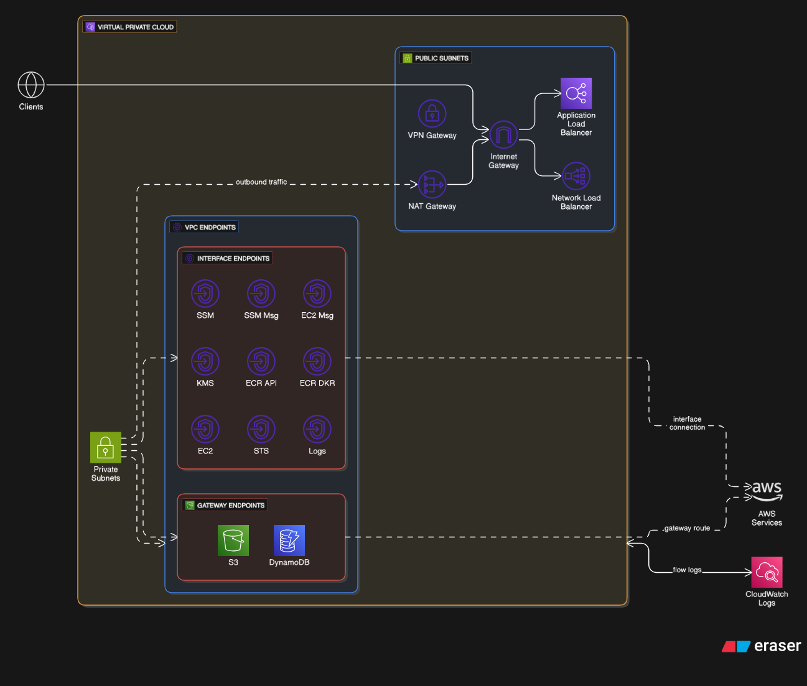

# urukube-terraform-module-networking

A comprehensive Terraform module for setting up AWS networking infrastructure required for EKS clusters. This module provides a one-stop solution for VPC, subnets, NAT gateways, security groups, VPC endpoints, and optional Network/Application Load Balancer configuration.

<p align="center">
  
  <h4 align="center">Module Architecture - Networking</h4>
</p>

## Features

- 🌐 **Complete VPC Setup** - VPC with configurable CIDR blocks and DNS settings
- 🏢 **Multi-AZ Architecture** - High availability across multiple availability zones
- 🔒 **Private & Public Subnets** - Auto-calculated subnet CIDRs with proper EKS tagging
- 🚀 **NAT Gateway** - HA or single NAT gateway options for cost optimization
- 🔐 **Security Groups** - Pre-configured for EKS nodes, control plane, and VPC endpoints
- 🔌 **VPC Endpoints** - Interface and gateway endpoints for AWS services (SSM, KMS, ECR, S3, etc.)
- ⚖️ **Network Load Balancer** - Optional NLB for external access
- ⚖️ **Application Load Balancer** - Optional ALB with HTTP/HTTPS support
- 🕸️ **Service Mesh Ready** - Optional Istio security group configuration
- 📊 **VPC Flow Logs** - Optional CloudWatch logging for network traffic analysis
- 🏷️ **EKS Auto-Discovery** - Proper subnet tagging for automatic EKS integration

## Architecture

This module implements the following AWS networking architecture:

- **VPC** with configurable CIDR (default: `10.0.0.0/16`)
- **Public Subnets** across multiple AZs for NAT gateways and load balancers
- **Private Subnets** across multiple AZs for EKS nodes and pods
- **Internet Gateway** for public subnet internet access
- **NAT Gateways** for private subnet outbound internet access
- **VPC Endpoints** to reduce NAT costs and improve security
- **Security Groups** for nodes, control plane, and VPC endpoints
- **Optional Network Load Balancer** for TCP 443 traffic
- **Optional Application Load Balancer** for HTTP/HTTPS traffic

## Inputs

| Name                           | Description                           | Type           | Default         | Required |
| :----------------------------- | :------------------------------------ | :------------- | :-------------- | :------- |
| `bu_id`                        | Business Unit                         | `string`       | `null`          | **yes**  |
| `app_id`                       | Application Unit                      | `string`       | `null`          | **yes**  |
| `env`                          | Environment name (dev, staging, prod) | `string`       | n/a             | **yes**  |
| `vpc_cidr`                     | CIDR block for VPC                    | `string`       | `"10.0.0.0/16"` | no       |
| `azs`                          | Availability zones                    | `list(string)` | `[]`            | no       |
| `private_subnets`              | Private subnet CIDRs                  | `list(string)` | `[]`            | no       |
| `public_subnets`               | Public subnet CIDRs                   | `list(string)` | `[]`            | no       |
| `enable_nat_gateway`           | Enable NAT Gateway                    | `bool`         | `true`          | no       |
| `single_nat_gateway`           | Use single NAT Gateway                | `bool`         | `false`         | no       |
| `enable_dns_hostnames`         | Enable DNS hostnames                  | `bool`         | `true`          | no       |
| `enable_dns_support`           | Enable DNS support                    | `bool`         | `true`          | no       |
| `enable_vpn_gateway`           | Enable VPN Gateway                    | `bool`         | `false`         | no       |
| `enable_flow_logs`             | Enable VPC Flow Logs                  | `bool`         | `false`         | no       |
| `flow_logs_retention_days`     | Flow logs retention days              | `number`       | `7`             | no       |
| `enable_vpc_endpoints`         | Enable VPC endpoints                  | `bool`         | `true`          | no       |
| `vpc_endpoints`                | VPC endpoints map                     | `map(bool)`    | `{...}`         | no       |
| `enable_network_load_balancer` | Enable NLB                            | `bool`         | `false`         | no       |
| `nlb_subnet_ids`               | NLB subnet IDs                        | `list(string)` | `[]`            | no       |
| `nlb_deletion_protection`      | NLB deletion protection               | `bool`         | `true`          | no       |
| `nlb_access_logs_bucket_name`  | NLB logs bucket                       | `string`       | `null`          | no       |
| `nlb_access_logs_prefix`       | NLB logs prefix                       | `string`       | `null`          | no       |
| `enable_alb`                   | Enable ALB                            | `bool`         | `false`         | no       |
| `alb_subnet_ids`               | ALB subnet IDs                        | `list(string)` | `[]`            | no       |
| `alb_deletion_protection`      | ALB deletion protection               | `bool`         | `true`          | no       |
| `alb_access_logs_bucket_name`  | ALB logs bucket                       | `string`       | `null`          | no       |
| `alb_access_logs_prefix`       | ALB logs prefix                       | `string`       | `null`          | no       |
| `alb_http_enabled`             | Enable ALB HTTP                       | `bool`         | `true`          | no       |
| `alb_https_enabled`            | Enable ALB HTTPS                      | `bool`         | `true`          | no       |
| `alb_certificate_arn`          | ALB Certificate ARN                   | `string`       | `null`          | no       |
| `alb_ingress_cidr_blocks`      | ALB Ingress CIDRs                     | `list(string)` | `["0.0.0.0/0"]` | no       |
| `enable_istio_support`         | Enable Istio support                  | `bool`         | `false`         | no       |
| `tags`                         | Additional tags                       | `map(string)`  | `{}`            | no       |

## Outputs

| Name                                 | Description                              |
| :----------------------------------- | :--------------------------------------- |
| `vpc_id`                             | VPC ID                                   |
| `vpc_cidr`                           | VPC CIDR block                           |
| `vpc_arn`                            | ARN of the VPC                           |
| `vpc_tags`                           | Tags applied to the VPC                  |
| `private_subnet_ids`                 | List of private subnet IDs               |
| `public_subnet_ids`                  | List of public subnet IDs                |
| `all_subnet_ids`                     | Combined list of all subnet IDs          |
| `private_subnet_cidrs`               | List of private subnet CIDR blocks       |
| `public_subnet_cidrs`                | List of public subnet CIDR blocks        |
| `nat_gateway_ids`                    | NAT Gateway IDs                          |
| `nat_gateway_public_ips`             | Elastic IPs of NAT Gateways              |
| `azs`                                | Availability zones used                  |
| `node_security_group_id`             | Security group ID for EKS nodes          |
| `control_plane_security_group_id`    | Security group ID for EKS control plane  |
| `vpc_endpoint_security_group_id`     | Security group ID for VPC endpoints      |
| `istio_security_group_id`            | Security group ID for Istio service mesh |
| `vpc_default_security_group_id`      | Default VPC security group ID            |
| `vpc_endpoints`                      | Map of VPC endpoint IDs                  |
| `vpc_endpoint_interface_dns_entries` | DNS entries for interface VPC endpoints  |
| `nlb_arn`                            | Network Load Balancer ARN                |
| `nlb_dns_name`                       | Network Load Balancer DNS name           |
| `nlb_zone_id`                        | Network Load Balancer hosted zone ID     |
| `nlb_target_group_arn`               | NLB target group ARN                     |
| `alb_arn`                            | Application Load Balancer ARN            |
| `alb_dns_name`                       | Application Load Balancer DNS name       |
| `alb_zone_id`                        | Application Load Balancer hosted zone ID |
| `alb_security_group_id`              | Security group ID for ALB                |

## Usage

### Comprehensive Example with All Parameters

```hcl
module "networking" {
  source = "github.com/orbitcluster/oc-terraform-module-networking"

  # ===================================
  # Required Parameters
  # ===================================

  # Business Unit ID
  bu_id = "marketing"

  # Application ID
  app_id = "ecommerce"

  # Environment: dev, staging, or prod
  env = "prod"

  # ===================================
  # VPC Configuration (Optional)
  # ===================================

  # VPC CIDR block (default: "10.0.0.0/16")
  vpc_cidr = "10.0.0.0/16"

  # Availability zones (default: auto-detect 2-3 AZs in region)
  azs = ["us-east-1a", "us-east-1b", "us-east-1c"]

  # Private subnet CIDRs (default: auto-calculated from vpc_cidr)
  # These subnets will host EKS worker nodes and pods
  private_subnets = ["10.0.0.0/19", "10.0.32.0/19", "10.0.64.0/19"]

  # Public subnet CIDRs (default: auto-calculated from vpc_cidr)
  # These subnets will host NAT gateways and load balancers
  public_subnets = ["10.0.96.0/24", "10.0.97.0/24", "10.0.98.0/24"]

  # Enable DNS hostnames in VPC (default: true)
  enable_dns_hostnames = true

  # Enable DNS support in VPC (default: true)
  enable_dns_support = true

  # Enable VPN Gateway (default: false)
  enable_vpn_gateway = false

  # ===================================
  # NAT Gateway Configuration (Optional)
  # ===================================

  # Enable NAT Gateway for private subnet internet access (default: true)
  enable_nat_gateway = true

  # Use single NAT Gateway instead of one per AZ (default: false)
  # Set to true for cost savings in dev/test (~$32/mo vs ~$96/mo for 3 AZs)
  # Set to false for production HA
  single_nat_gateway = false

  # ===================================
  # VPC Endpoints Configuration (Optional)
  # ===================================

  # Enable VPC endpoints for AWS services (default: true)
  # Reduces NAT Gateway costs and improves security
  enable_vpc_endpoints = true

  # Individual VPC endpoint controls
  vpc_endpoints = {
    ssm         = true  # Systems Manager
    ssmmessages = true  # SSM Session Manager
    ec2messages = true  # SSM agent communication
    kms         = true  # Key Management Service
    ecr_api     = true  # ECR API (for pulling container images)
    ecr_dkr     = true  # ECR Docker registry
    ec2         = true  # EC2 API
    sts         = true  # Security Token Service
    logs        = true  # CloudWatch Logs
    s3          = true  # S3 Gateway endpoint
    dynamodb    = false # DynamoDB Gateway endpoint
  }

  # ===================================
  # Network Load Balancer (Optional)
  # ===================================

  # Create Network Load Balancer in public subnets (default: false)
  enable_network_load_balancer = true

  # Subnet IDs for NLB (default: uses public_subnets)
  # nlb_subnet_ids = ["subnet-xxx", "subnet-yyy"]

  # Enable deletion protection for NLB (default: true)
  nlb_deletion_protection = true

  # ===================================
  # Application Load Balancer (Optional)
  # ===================================

  # Create Application Load Balancer (default: false)
  enable_alb = true

  # Enable HTTP Listener (default: true)
  alb_http_enabled = true

  # Enable HTTPS Listener (default: true)
  alb_https_enabled = true

  # ACM Certificate ARN for HTTPS listener
  alb_certificate_arn = "arn:aws:acm:us-east-1:123456789012:certificate/..."

  # ===================================
  # Service Mesh Support (Optional)
  # ===================================

  # Configure security groups for Istio service mesh (default: false)
  # Adds ingress rules for Istio ports (15010-15012, 8080, 8443)
  enable_istio_support = true

  # ===================================
  # VPC Flow Logs (Optional)
  # ===================================

  # Enable VPC Flow Logs to CloudWatch (default: false)
  enable_flow_logs = true

  # CloudWatch log retention in days (default: 7)
  # Valid values: 1, 3, 5, 7, 14, 30, 60, 90, 120, 150, 180, 365, 400, 545, 731, etc.
  flow_logs_retention_days = 30
}
```

## Subnet CIDR Calculation

If you don't specify subnet CIDRs, they will be auto-calculated from the VPC CIDR:

**For VPC CIDR `10.0.0.0/16`:**

- Private Subnets (each /19, 8,192 IPs):
  - AZ 1: `10.0.0.0/19`
  - AZ 2: `10.0.32.0/19`
  - AZ 3: `10.0.64.0/19`
- Public Subnets (each /24, 256 IPs):
  - AZ 1: `10.0.96.0/24`
  - AZ 2: `10.0.97.0/24`
  - AZ 3: `10.0.98.0/24`

## Security Best Practices

1. **Use VPC Endpoints** - Reduce exposure to internet and lower NAT costs
2. **Enable Flow Logs** - Monitor network traffic for security analysis
3. **Private Subnets** - Run EKS nodes in private subnets only
4. **Security Groups** - Use provided security groups instead of wide-open rules
5. **Multi-AZ** - Deploy across multiple AZs for high availability

## License

This module is part of OrbitCluster and follows the project's licensing terms.

<!-- BEGIN_TF_DOCS -->

## Requirements

| Name                                                                     | Version              |
| ------------------------------------------------------------------------ | -------------------- |
| <a name="requirement_terraform"></a> [terraform](#requirement_terraform) | >= 1.5.0             |
| <a name="requirement_aws"></a> [aws](#requirement_aws)                   | >= 6.15.0, <= 6.31.0 |

## Providers

| Name                                             | Version              |
| ------------------------------------------------ | -------------------- |
| <a name="provider_aws"></a> [aws](#provider_aws) | >= 6.15.0, <= 6.31.0 |

## Modules

| Name                                         | Source                        | Version  |
| -------------------------------------------- | ----------------------------- | -------- |
| <a name="module_vpc"></a> [vpc](#module_vpc) | terraform-aws-modules/vpc/aws | ~> 5.5.0 |

## Resources

| Name                                                                                                                                                                            | Type        |
| ------------------------------------------------------------------------------------------------------------------------------------------------------------------------------- | ----------- |
| [aws_lb.application](https://registry.terraform.io/providers/hashicorp/aws/latest/docs/resources/lb)                                                                            | resource    |
| [aws_lb.network](https://registry.terraform.io/providers/hashicorp/aws/latest/docs/resources/lb)                                                                                | resource    |
| [aws_lb_listener.application_http](https://registry.terraform.io/providers/hashicorp/aws/latest/docs/resources/lb_listener)                                                     | resource    |
| [aws_lb_listener.application_https](https://registry.terraform.io/providers/hashicorp/aws/latest/docs/resources/lb_listener)                                                    | resource    |
| [aws_lb_listener.network](https://registry.terraform.io/providers/hashicorp/aws/latest/docs/resources/lb_listener)                                                              | resource    |
| [aws_lb_target_group.application](https://registry.terraform.io/providers/hashicorp/aws/latest/docs/resources/lb_target_group)                                                  | resource    |
| [aws_lb_target_group.network](https://registry.terraform.io/providers/hashicorp/aws/latest/docs/resources/lb_target_group)                                                      | resource    |
| [aws_security_group.alb](https://registry.terraform.io/providers/hashicorp/aws/latest/docs/resources/security_group)                                                            | resource    |
| [aws_security_group.eks_control_plane](https://registry.terraform.io/providers/hashicorp/aws/latest/docs/resources/security_group)                                              | resource    |
| [aws_security_group.eks_nodes](https://registry.terraform.io/providers/hashicorp/aws/latest/docs/resources/security_group)                                                      | resource    |
| [aws_security_group.istio](https://registry.terraform.io/providers/hashicorp/aws/latest/docs/resources/security_group)                                                          | resource    |
| [aws_security_group.vpc_endpoints](https://registry.terraform.io/providers/hashicorp/aws/latest/docs/resources/security_group)                                                  | resource    |
| [aws_vpc_endpoint.gateway](https://registry.terraform.io/providers/hashicorp/aws/latest/docs/resources/vpc_endpoint)                                                            | resource    |
| [aws_vpc_endpoint.interface](https://registry.terraform.io/providers/hashicorp/aws/latest/docs/resources/vpc_endpoint)                                                          | resource    |
| [aws_vpc_security_group_egress_rule.alb_egress](https://registry.terraform.io/providers/hashicorp/aws/latest/docs/resources/vpc_security_group_egress_rule)                     | resource    |
| [aws_vpc_security_group_egress_rule.control_plane_to_nodes_https](https://registry.terraform.io/providers/hashicorp/aws/latest/docs/resources/vpc_security_group_egress_rule)   | resource    |
| [aws_vpc_security_group_egress_rule.control_plane_to_nodes_kubelet](https://registry.terraform.io/providers/hashicorp/aws/latest/docs/resources/vpc_security_group_egress_rule) | resource    |
| [aws_vpc_security_group_egress_rule.eks_nodes_egress](https://registry.terraform.io/providers/hashicorp/aws/latest/docs/resources/vpc_security_group_egress_rule)               | resource    |
| [aws_vpc_security_group_egress_rule.istio_egress](https://registry.terraform.io/providers/hashicorp/aws/latest/docs/resources/vpc_security_group_egress_rule)                   | resource    |
| [aws_vpc_security_group_egress_rule.vpc_endpoints_egress](https://registry.terraform.io/providers/hashicorp/aws/latest/docs/resources/vpc_security_group_egress_rule)           | resource    |
| [aws_vpc_security_group_ingress_rule.alb_http](https://registry.terraform.io/providers/hashicorp/aws/latest/docs/resources/vpc_security_group_ingress_rule)                     | resource    |
| [aws_vpc_security_group_ingress_rule.alb_https](https://registry.terraform.io/providers/hashicorp/aws/latest/docs/resources/vpc_security_group_ingress_rule)                    | resource    |
| [aws_vpc_security_group_ingress_rule.control_plane_from_nodes](https://registry.terraform.io/providers/hashicorp/aws/latest/docs/resources/vpc_security_group_ingress_rule)     | resource    |
| [aws_vpc_security_group_ingress_rule.eks_nodes_nlb_ingress](https://registry.terraform.io/providers/hashicorp/aws/latest/docs/resources/vpc_security_group_ingress_rule)        | resource    |
| [aws_vpc_security_group_ingress_rule.eks_nodes_vpc_ingress](https://registry.terraform.io/providers/hashicorp/aws/latest/docs/resources/vpc_security_group_ingress_rule)        | resource    |
| [aws_vpc_security_group_ingress_rule.istio_https](https://registry.terraform.io/providers/hashicorp/aws/latest/docs/resources/vpc_security_group_ingress_rule)                  | resource    |
| [aws_vpc_security_group_ingress_rule.istio_ingress](https://registry.terraform.io/providers/hashicorp/aws/latest/docs/resources/vpc_security_group_ingress_rule)                | resource    |
| [aws_vpc_security_group_ingress_rule.istio_pilot](https://registry.terraform.io/providers/hashicorp/aws/latest/docs/resources/vpc_security_group_ingress_rule)                  | resource    |
| [aws_vpc_security_group_ingress_rule.vpc_endpoints_https](https://registry.terraform.io/providers/hashicorp/aws/latest/docs/resources/vpc_security_group_ingress_rule)          | resource    |
| [aws_availability_zones.available](https://registry.terraform.io/providers/hashicorp/aws/latest/docs/data-sources/availability_zones)                                           | data source |
| [aws_caller_identity.current](https://registry.terraform.io/providers/hashicorp/aws/latest/docs/data-sources/caller_identity)                                                   | data source |
| [aws_region.current](https://registry.terraform.io/providers/hashicorp/aws/latest/docs/data-sources/region)                                                                     | data source |

## Inputs

| Name                                                                                                                  | Description                                                                                                                    | Type           | Default                                                                                                                                                                                                                                               | Required |
| --------------------------------------------------------------------------------------------------------------------- | ------------------------------------------------------------------------------------------------------------------------------ | -------------- | ----------------------------------------------------------------------------------------------------------------------------------------------------------------------------------------------------------------------------------------------------- | :------: |
| <a name="input_alb_access_logs_bucket_name"></a> [alb_access_logs_bucket_name](#input_alb_access_logs_bucket_name)    | S3 bucket name for ALB access logs. If null, logging is disabled                                                               | `string`       | `null`                                                                                                                                                                                                                                                |    no    |
| <a name="input_alb_access_logs_prefix"></a> [alb_access_logs_prefix](#input_alb_access_logs_prefix)                   | S3 prefix for ALB access logs                                                                                                  | `string`       | `null`                                                                                                                                                                                                                                                |    no    |
| <a name="input_alb_certificate_arn"></a> [alb_certificate_arn](#input_alb_certificate_arn)                            | ARN of ACM certificate for HTTPS listener                                                                                      | `string`       | `null`                                                                                                                                                                                                                                                |    no    |
| <a name="input_alb_deletion_protection"></a> [alb_deletion_protection](#input_alb_deletion_protection)                | Enable deletion protection for ALB                                                                                             | `bool`         | `true`                                                                                                                                                                                                                                                |    no    |
| <a name="input_alb_http_enabled"></a> [alb_http_enabled](#input_alb_http_enabled)                                     | Enable HTTP listener for ALB                                                                                                   | `bool`         | `true`                                                                                                                                                                                                                                                |    no    |
| <a name="input_alb_https_enabled"></a> [alb_https_enabled](#input_alb_https_enabled)                                  | Enable HTTPS listener for ALB                                                                                                  | `bool`         | `true`                                                                                                                                                                                                                                                |    no    |
| <a name="input_alb_ingress_cidr_blocks"></a> [alb_ingress_cidr_blocks](#input_alb_ingress_cidr_blocks)                | List of CIDR blocks to allow ingress to ALB (HTTP/HTTPS)                                                                       | `list(string)` | <pre>[<br/> "0.0.0.0/0"<br/>]</pre>                                                                                                                                                                                                                   |    no    |
| <a name="input_alb_subnet_ids"></a> [alb_subnet_ids](#input_alb_subnet_ids)                                           | Subnet IDs for ALB. If not specified, uses public subnets                                                                      | `list(string)` | `[]`                                                                                                                                                                                                                                                  |    no    |
| <a name="input_app_id"></a> [app_id](#input_app_id)                                                                   | application Unit                                                                                                               | `string`       | `null`                                                                                                                                                                                                                                                |    no    |
| <a name="input_azs"></a> [azs](#input_azs)                                                                            | List of availability zones. If not provided, will auto-detect 2-3 AZs in the region                                            | `list(string)` | `[]`                                                                                                                                                                                                                                                  |    no    |
| <a name="input_bu_id"></a> [bu_id](#input_bu_id)                                                                      | Business Unit                                                                                                                  | `string`       | `null`                                                                                                                                                                                                                                                |    no    |
| <a name="input_enable_alb"></a> [enable_alb](#input_enable_alb)                                                       | Create Application Load Balancer                                                                                               | `bool`         | `false`                                                                                                                                                                                                                                               |    no    |
| <a name="input_enable_dns_hostnames"></a> [enable_dns_hostnames](#input_enable_dns_hostnames)                         | Enable DNS hostnames in VPC                                                                                                    | `bool`         | `true`                                                                                                                                                                                                                                                |    no    |
| <a name="input_enable_dns_support"></a> [enable_dns_support](#input_enable_dns_support)                               | Enable DNS support in VPC                                                                                                      | `bool`         | `true`                                                                                                                                                                                                                                                |    no    |
| <a name="input_enable_flow_logs"></a> [enable_flow_logs](#input_enable_flow_logs)                                     | Enable VPC Flow Logs to CloudWatch                                                                                             | `bool`         | `false`                                                                                                                                                                                                                                               |    no    |
| <a name="input_enable_istio_support"></a> [enable_istio_support](#input_enable_istio_support)                         | Configure security groups for Istio service mesh                                                                               | `bool`         | `false`                                                                                                                                                                                                                                               |    no    |
| <a name="input_enable_nat_gateway"></a> [enable_nat_gateway](#input_enable_nat_gateway)                               | Enable NAT Gateway for private subnets                                                                                         | `bool`         | `true`                                                                                                                                                                                                                                                |    no    |
| <a name="input_enable_network_load_balancer"></a> [enable_network_load_balancer](#input_enable_network_load_balancer) | Create Network Load Balancer in public subnets                                                                                 | `bool`         | `false`                                                                                                                                                                                                                                               |    no    |
| <a name="input_enable_vpc_endpoints"></a> [enable_vpc_endpoints](#input_enable_vpc_endpoints)                         | Enable VPC endpoints for AWS services                                                                                          | `bool`         | `true`                                                                                                                                                                                                                                                |    no    |
| <a name="input_enable_vpn_gateway"></a> [enable_vpn_gateway](#input_enable_vpn_gateway)                               | Enable VPN Gateway                                                                                                             | `bool`         | `false`                                                                                                                                                                                                                                               |    no    |
| <a name="input_env"></a> [env](#input_env)                                                                            | Environment name (dev, staging, prod)                                                                                          | `string`       | n/a                                                                                                                                                                                                                                                   |   yes    |
| <a name="input_flow_logs_retention_days"></a> [flow_logs_retention_days](#input_flow_logs_retention_days)             | CloudWatch log retention for flow logs in days                                                                                 | `number`       | `7`                                                                                                                                                                                                                                                   |    no    |
| <a name="input_friendly_name"></a> [friendly_name](#input_friendly_name)                                              | Friendly name prefix for resources (e.g., 'allhub', 'devspoke'). Used in resource naming and EKS cluster identification.       | `string`       | n/a                                                                                                                                                                                                                                                   |   yes    |
| <a name="input_nlb_access_logs_bucket_name"></a> [nlb_access_logs_bucket_name](#input_nlb_access_logs_bucket_name)    | S3 bucket name for NLB access logs. If null, logging is disabled                                                               | `string`       | `null`                                                                                                                                                                                                                                                |    no    |
| <a name="input_nlb_access_logs_prefix"></a> [nlb_access_logs_prefix](#input_nlb_access_logs_prefix)                   | S3 prefix for NLB access logs                                                                                                  | `string`       | `null`                                                                                                                                                                                                                                                |    no    |
| <a name="input_nlb_deletion_protection"></a> [nlb_deletion_protection](#input_nlb_deletion_protection)                | Enable deletion protection for Network Load Balancer                                                                           | `bool`         | `true`                                                                                                                                                                                                                                                |    no    |
| <a name="input_nlb_subnet_ids"></a> [nlb_subnet_ids](#input_nlb_subnet_ids)                                           | Subnet IDs for NLB. If not specified, uses public subnets                                                                      | `list(string)` | `[]`                                                                                                                                                                                                                                                  |    no    |
| <a name="input_private_subnets"></a> [private_subnets](#input_private_subnets)                                        | List of CIDR blocks for private subnets. If not provided, will auto-calculate based on VPC CIDR                                | `list(string)` | `[]`                                                                                                                                                                                                                                                  |    no    |
| <a name="input_public_subnets"></a> [public_subnets](#input_public_subnets)                                           | List of CIDR blocks for public subnets. If not provided, will auto-calculate based on VPC CIDR                                 | `list(string)` | `[]`                                                                                                                                                                                                                                                  |    no    |
| <a name="input_single_nat_gateway"></a> [single_nat_gateway](#input_single_nat_gateway)                               | Use single NAT Gateway to reduce costs (not recommended for production)                                                        | `bool`         | `false`                                                                                                                                                                                                                                               |    no    |
| <a name="input_tags"></a> [tags](#input_tags)                                                                         | Additional tags for all resources                                                                                              | `map(string)`  | `{}`                                                                                                                                                                                                                                                  |    no    |
| <a name="input_vpc_cidr"></a> [vpc_cidr](#input_vpc_cidr)                                                             | CIDR block for VPC                                                                                                             | `string`       | `"10.0.0.0/16"`                                                                                                                                                                                                                                       |    no    |
| <a name="input_vpc_endpoints"></a> [vpc_endpoints](#input_vpc_endpoints)                                              | Map of VPC endpoints to create. Valid keys: ssm, ssmmessages, ec2messages, kms, ecr_api, ecr_dkr, ec2, sts, logs, s3, dynamodb | `map(bool)`    | <pre>{<br/> "dynamodb": false,<br/> "ec2": true,<br/> "ec2messages": true,<br/> "ecr_api": true,<br/> "ecr_dkr": true,<br/> "kms": true,<br/> "logs": true,<br/> "s3": true,<br/> "ssm": true,<br/> "ssmmessages": true,<br/> "sts": true<br/>}</pre> |    no    |

## Outputs

| Name                                                                                                                                      | Description                                           |
| ----------------------------------------------------------------------------------------------------------------------------------------- | ----------------------------------------------------- |
| <a name="output_alb_arn"></a> [alb_arn](#output_alb_arn)                                                                                  | Application Load Balancer ARN (if created)            |
| <a name="output_alb_dns_name"></a> [alb_dns_name](#output_alb_dns_name)                                                                   | Application Load Balancer DNS name (if created)       |
| <a name="output_alb_security_group_id"></a> [alb_security_group_id](#output_alb_security_group_id)                                        | Security group ID for ALB (if created)                |
| <a name="output_alb_zone_id"></a> [alb_zone_id](#output_alb_zone_id)                                                                      | Application Load Balancer hosted zone ID (if created) |
| <a name="output_all_subnet_ids"></a> [all_subnet_ids](#output_all_subnet_ids)                                                             | Combined list of all subnet IDs                       |
| <a name="output_azs"></a> [azs](#output_azs)                                                                                              | Availability zones used                               |
| <a name="output_control_plane_security_group_id"></a> [control_plane_security_group_id](#output_control_plane_security_group_id)          | Security group ID for EKS control plane               |
| <a name="output_igw_id"></a> [igw_id](#output_igw_id)                                                                                     | Internet Gateway ID                                   |
| <a name="output_istio_security_group_id"></a> [istio_security_group_id](#output_istio_security_group_id)                                  | Security group ID for Istio service mesh              |
| <a name="output_nat_gateway_ids"></a> [nat_gateway_ids](#output_nat_gateway_ids)                                                          | NAT Gateway IDs                                       |
| <a name="output_nat_gateway_public_ips"></a> [nat_gateway_public_ips](#output_nat_gateway_public_ips)                                     | Elastic IPs of NAT Gateways                           |
| <a name="output_nlb_arn"></a> [nlb_arn](#output_nlb_arn)                                                                                  | Network Load Balancer ARN (if created)                |
| <a name="output_nlb_dns_name"></a> [nlb_dns_name](#output_nlb_dns_name)                                                                   | Network Load Balancer DNS name (if created)           |
| <a name="output_nlb_target_group_arn"></a> [nlb_target_group_arn](#output_nlb_target_group_arn)                                           | NLB target group ARN (if created)                     |
| <a name="output_nlb_zone_id"></a> [nlb_zone_id](#output_nlb_zone_id)                                                                      | Network Load Balancer hosted zone ID (if created)     |
| <a name="output_node_security_group_id"></a> [node_security_group_id](#output_node_security_group_id)                                     | Security group ID for EKS nodes                       |
| <a name="output_private_route_table_ids"></a> [private_route_table_ids](#output_private_route_table_ids)                                  | Private route table IDs                               |
| <a name="output_private_subnet_cidrs"></a> [private_subnet_cidrs](#output_private_subnet_cidrs)                                           | List of private subnet CIDR blocks                    |
| <a name="output_private_subnet_ids"></a> [private_subnet_ids](#output_private_subnet_ids)                                                 | List of private subnet IDs (for EKS nodes)            |
| <a name="output_public_route_table_ids"></a> [public_route_table_ids](#output_public_route_table_ids)                                     | Public route table IDs                                |
| <a name="output_public_subnet_cidrs"></a> [public_subnet_cidrs](#output_public_subnet_cidrs)                                              | List of public subnet CIDR blocks                     |
| <a name="output_public_subnet_ids"></a> [public_subnet_ids](#output_public_subnet_ids)                                                    | List of public subnet IDs (for load balancers)        |
| <a name="output_vpc_arn"></a> [vpc_arn](#output_vpc_arn)                                                                                  | ARN of the VPC                                        |
| <a name="output_vpc_cidr"></a> [vpc_cidr](#output_vpc_cidr)                                                                               | VPC CIDR block                                        |
| <a name="output_vpc_default_security_group_id"></a> [vpc_default_security_group_id](#output_vpc_default_security_group_id)                | Default VPC security group ID                         |
| <a name="output_vpc_endpoint_interface_dns_entries"></a> [vpc_endpoint_interface_dns_entries](#output_vpc_endpoint_interface_dns_entries) | DNS entries for interface VPC endpoints               |
| <a name="output_vpc_endpoint_security_group_id"></a> [vpc_endpoint_security_group_id](#output_vpc_endpoint_security_group_id)             | Security group ID for VPC endpoints                   |
| <a name="output_vpc_endpoints"></a> [vpc_endpoints](#output_vpc_endpoints)                                                                | Map of VPC endpoint IDs                               |
| <a name="output_vpc_id"></a> [vpc_id](#output_vpc_id)                                                                                     | VPC ID for EKS module                                 |
| <a name="output_vpc_tags"></a> [vpc_tags](#output_vpc_tags)                                                                               | Tags applied to the VPC                               |

<!-- END_TF_DOCS -->
